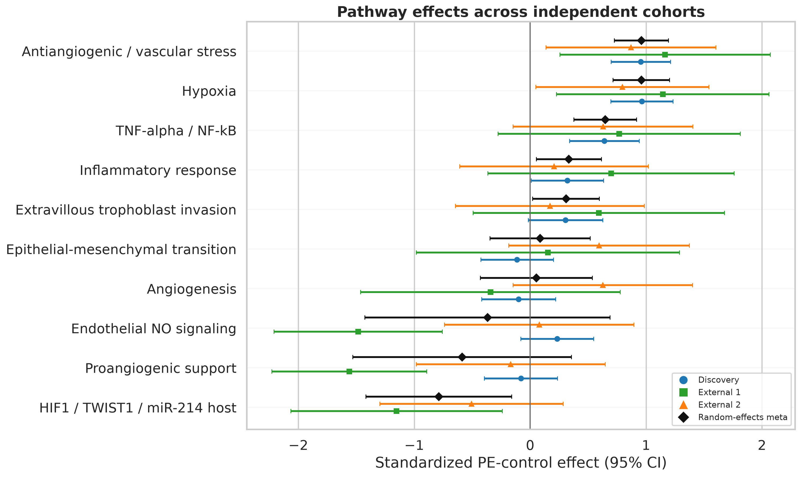
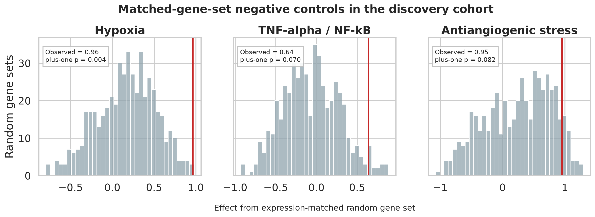

# Preeclampsia Cross-Cohort Reproducibility Pilot

> A lineage-aware evaluation of placental hypoxia, inflammatory, angiogenic,
> and endothelial transcriptomic signals using public human cohorts.

**Status:** Cross-cohort reproducibility pilot completed · Prospective validation pending<br>
**Intended use:** Reproducible research and portfolio demonstration<br>
**Not intended for:** Diagnosis, patient-level prediction, or clinical decision-making

## Research question

Which proposed placental mechanisms of preeclampsia reproduce across genuinely
independent human transcriptomic cohorts after accounting for dataset genealogy,
assay differences, measured covariates, and pathway-specific negative controls?

## Main finding

Placental hypoxia and antiangiogenic/vascular-stress signals reproduced strongly
across the independent cohorts. TNF-alpha/NF-kB signaling also showed a consistent
positive effect. However, proangiogenic support, endothelial nitric-oxide
signaling, and several individual markers were heterogeneous or unresolved.

| Pathway | Pooled standardized effect | 95% CI | I2 |
|---|---:|---:|---:|
| Antiangiogenic/vascular stress | **0.959** | 0.725 to 1.193 | 0% |
| Hypoxia | **0.958** | 0.714 to 1.201 | 0% |
| TNF-alpha/NF-kB signaling | **0.646** | 0.375 to 0.917 | 0% |

Five prespecified pathways passed FDR 0.05 in the independent-cohort
meta-analysis. FLT1, ENG, and SERPINE1 were among the strongest consistent
gene-level signals. A standardized effect near 0.96 means that the pathway score
was approximately 0.96 cohort standard deviations higher in preeclampsia than in
controls; it is not a similarity percentage or a measure of clinical utility.



## Why this project matters

Cross-study transcriptomic findings can look convincing when integrated datasets
are treated as independent validation, platforms are pooled without regard to
scale, or only significant pathways are reported. This project instead
emphasizes:

- sample-level dataset-lineage auditing;
- separation of genuinely independent and internally reused cohorts;
- cohort-specific preprocessing and modeling;
- random-effects meta-analysis of standardized effects;
- leave-one-cohort-out and composition-proxy sensitivity analyses;
- matched-gene-set and outcome-label permutation controls;
- explicit separation of replicated mRNA evidence from exploratory miRNA results.

The contribution is methodological rather than clinical: the workflow shows how
to test whether proposed biological mechanisms remain credible after duplicate
samples, cross-platform differences, heterogeneity, and pathway specificity are
examined directly.

## Cohorts

The primary analysis used public, de-identified placental transcriptomic data:

- **GSE75010 BioBank discovery:** 157 newly collected placentas, including 80
  preeclampsia and 77 non-preeclampsia samples;
- **GSE190971 external replication:** 7 preeclampsia and 6 control RNA-seq
  samples;
- **GSE204835 external replication:** 12 term preeclampsia and 12 term control
  FFPE RNA-seq samples;
- **GSE177049 exploratory mRNA/miRNA:** 5 early-onset preeclampsia and 5 preterm
  control placentas.

GSE75010 is an integrated 330-profile matrix. It contains 157 newly collected
BioBank samples and 173 profiles imported from seven earlier GEO studies. The
imported samples were retained for internal reproducibility analyses only and
were never presented as external validation. Their complete lineage is recorded
in [`data/processed/cohort_manifest.csv`](data/processed/cohort_manifest.csv).

## Validation design

```text
GSE75010 integrated matrix
    │
    ├── 157 new BioBank samples
    │       └── covariate-adjusted discovery analysis
    │
    └── 173 previously published profiles
            └── historical internal replication only

Independent evidence
    ├── GSE190971 fresh-placenta RNA-seq
    └── GSE204835 term FFPE-placenta RNA-seq
            └── cohort-specific effects
                    └── random-effects meta-analysis
```

The discovery model was
`expression ~ PE + gestational_age + fetal_sex + chronic_hypertension`.
Microarray and RNA-seq cohorts were processed independently. Each pathway score
was computed from within-cohort gene z-scores, and cohort effects were combined
only after standardization. Benjamini-Hochberg FDR was applied within each
reported testing family.

No raw expression values were pooled across assay platforms. Detailed equations
and implementation decisions are documented in [`docs/METHODS.md`](docs/METHODS.md).

## Negative controls

Each measured pathway received two 500-iteration controls:

1. expression- and variance-matched random gene sets tested whether the observed
   pathway was unusually extreme relative to comparable genes;
2. preeclampsia labels were permuted within cohort to test whether the observed
   association exceeded chance label assignments.

- hypoxia matched-gene-set plus-one p: **0.004**;
- antiangiogenic/vascular-stress matched-gene-set plus-one p: 0.082;
- TNF-alpha/NF-kB matched-gene-set plus-one p: 0.070;
- label-permutation plus-one p for each of these three signals: **0.002**.



The controls support a strong hypoxia-specific signal. The antiangiogenic and
TNF-alpha/NF-kB modules separated the observed clinical labels, but were not
uniquely extreme relative to all matched random sets at the 0.05 threshold.

## Exploratory miRNA analysis

The small paired GSE177049 cohort was used to examine mature miRNA abundance and
prespecified miRNA-target correlations. None of the four mature miRNAs or the
prespecified correlations passed FDR 0.05. These results are descriptive and do
not establish miRNA regulation or causality.

## Repository map

| Path | Purpose |
|---|---|
| `config/analysis_plan.yaml` | Frozen research question, testing families, and interpretation rules |
| `config/source_urls.yaml` | Official GEO source locations |
| `data/processed/cohort_manifest.csv` | Sample-level provenance, inclusion role, and dataset genealogy |
| `data/processed/data_manifest.json` | Source hashes, byte counts, cohort counts, and metadata discrepancies |
| `docs/METHODS.md` | Statistical equations and methodological rationale |
| `scripts/00_download_data.py` | Download and verify public source files |
| `scripts/01_prepare_data.py` | Reconcile phenotypes, platforms, and expression matrices |
| `scripts/02_run_analysis.py` | Cohort models, meta-analysis, sensitivity analyses, and controls |
| `scripts/03_make_figures.py` | Generate retained figures |
| `scripts/99_quality_checks.py` | Full source, cohort, result, and artifact-integrity checks |
| `results/tables/` | Meta-analysis, sensitivity, miRNA, and negative-control tables |
| `results/figures/` | Main result figures |
| `output/pdf/` | Complete research report |

## Reproduce

### 1. Create the environment

```powershell
py -3.12 -m venv .venv
.\.venv\Scripts\python.exe -m pip install -r requirements.txt
```

### 2. Download and prepare the source studies

```powershell
.\.venv\Scripts\python.exe scripts\00_download_data.py
.\.venv\Scripts\python.exe scripts\01_prepare_data.py
```

The download script retrieves the official public files and verifies them
against the retained source manifest. Raw files and processed expression
matrices are intentionally excluded from Git.

### 3. Run the analysis
```powershell
.\.venv\Scripts\python.exe scripts\02_run_analysis.py
.\.venv\Scripts\python.exe scripts\03_make_figures.py
.\.venv\Scripts\python.exe scripts\99_quality_checks.py
```

For a lightweight check of the retained portfolio artifacts:

```powershell
py -3.12 scripts\98_repository_checks.py
```

## Data availability

Participant-level source and derived expression matrices are not redistributed
in this repository. The repository retains official source URLs, expected file
hashes, preparation code, sample-level provenance, aggregate tables, figures,
and the complete report.

Primary GEO records:

- [GSE75010](https://www.ncbi.nlm.nih.gov/geo/query/acc.cgi?acc=GSE75010)
- [GSE190971](https://www.ncbi.nlm.nih.gov/geo/query/acc.cgi?acc=GSE190971)
- [GSE204835](https://www.ncbi.nlm.nih.gov/geo/query/acc.cgi?acc=GSE204835)
- [GSE177049](https://www.ncbi.nlm.nih.gov/geo/query/acc.cgi?acc=GSE177049)

## Interpretation

The justified conclusion is:

> Placental hypoxia and antiangiogenic stress were strongly reproducible across
> the independent cohorts, while several other proposed mechanisms remained
> heterogeneous, nonspecific, or underpowered.

The results do not establish causality, a diagnostic classifier, a therapeutic
target, an actionable threshold, treatment benefit, or clinical utility.

## Limitations and next step

- retrospective public cohorts with different collection and assay protocols;
- small independent RNA-seq cohorts;
- bulk placental expression without definitive cell-type attribution;
- incomplete and inconsistent clinical covariates across external cohorts;
- HIF1A mRNA is not equivalent to HIF-1alpha protein stabilization;
- FLT1 gene-level expression does not isolate the soluble sFlt-1 isoform;
- only ten paired mRNA/miRNA samples in the exploratory analysis;
- no prospective cohort or locked clinical validation.

The next phase is prospective replication in an independently collected
placental cohort with harmonized phenotypes, gestational-age information,
cell-composition measurements, and a prespecified assay and analysis plan.

## Portfolio

This repository is a retrospective portfolio publication. Git was not used
prospectively throughout the original analysis, and the commit history begins
with the portfolio publication.

## License and source terms

Original software and documentation are released under the MIT License. Source
datasets remain subject to their original GEO and study-specific terms. Reusers
should cite the primary study publications as well as this workflow. Citation
metadata are provided in [`CITATION.cff`](CITATION.cff).
